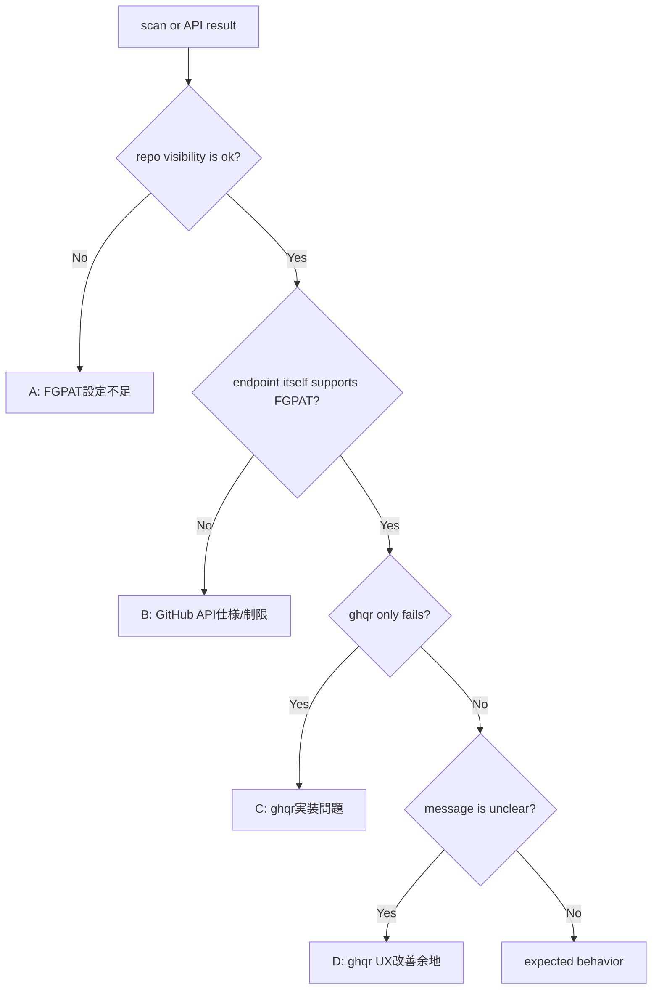

# ghqr Fine-Grained PAT Full Validation

この資料における `ghqr` は、リポジトリルートから実行する `./bin/linux_amd64/ghqr` の短縮表記である。

## 1. 目的

- `ghqr` の全機能が Fine-grained PAT でも利用可能かを検証する
- Classic PAT と Fine-grained PAT の挙動差分を整理する
- 差分が `ghqr` 実装の問題なのか、GitHub API 仕様なのか、FGPAT 権限設定不足なのかを分類する
- README に書くべき FGPAT 手順と注意事項を確定する
- 必要な実装修正がある場合だけ、最小変更案を提示する

## 2. この資料の扱い

- 事実と推論を分けて書く
- token 値は記録しない
- token の一部も記録しない
- `ghqr` の実行コマンドは必ず `./bin/linux_amd64/ghqr` と書く
- 生成物の出力場所は `~/dev/lab/oss/ghqr` と明記する
- 失敗した場合は必ず一次分類を書く

## 3. セッション定義

- `ユーザーWSL shell`
  - ユーザーが直接操作する通常シェル
  - export 済み token を保持できる
- `Codex shell`
  - この会話から起動するシェル
  - `ユーザーWSL shell` の export 済み環境変数は自動では見えない
- `GH_CONFIG_DIR=/tmp/gh-fgpat-org`
  - org owner `example-org` の Fine-grained PAT を隔離した `gh` 設定

## 3.1 この検証セッションの `ghqr` 短縮設定

- 実行セッション:
  - `ユーザーWSL shell`
  - `Codex shell`
- 推奨設定:
```bash
alias ghqr='./bin/linux_amd64/ghqr'
```
- 補足:
  - 恒久設定として `.bashrc` には書き込まない
  - この資料のコマンド例は `ghqr scan ...` 表記を使う
  - 実体は常に `./bin/linux_amd64/ghqr`

## 4. 前提

- 検証対象 organization は `example-org`
- 検証用 private repository は `example-org/fgpat-validation-repo`
- 以前、個人 owner の FGPAT で org private repository を読もうとして失敗した
- その後、Resource owner を `example-org` にした FGPAT を作成し直した
- Repository access は `Only select repositories`
- 対象 repository は `example-org/fgpat-validation-repo`
- 現時点の最低権限は次の 3 つ
  - `Metadata: Read-only`
  - `Contents: Read-only`
  - `Administration: Read-only`

## 5. 既知の事実

### 5.1 REST API 可視性確認は成功済み

- 実行セッション:
  - `GH_CONFIG_DIR=/tmp/gh-fgpat-org`
- 実行コマンド:
```bash
GH_CONFIG_DIR=/tmp/gh-fgpat-org gh api repos/example-org/fgpat-validation-repo --jq .full_name
```
- 実際の結果:
```text
example-org/fgpat-validation-repo
```
- 解釈:
  - Fine-grained PAT から対象 private repository は可視

### 5.2 explicit repository scan は成功済み

- 実行セッション:
  - `Codex shell`
  - token source は `GH_CONFIG_DIR=/tmp/gh-fgpat-org`
- 実行コマンド:
```bash
env GITHUB_TOKEN="$(GH_CONFIG_DIR=/tmp/gh-fgpat-org gh auth token)" \
./bin/linux_amd64/ghqr scan \
--repository example-org/fgpat-validation-repo
```
- 実際の結果:
  - GraphQL repository 解決成功
  - ruleset enrichment 成功
  - evaluation 成功
  - report rendering 成功
  - `results=6`
  - scan 完走
- 生成物:
  - `example-output.json`
  - `example-output.xlsx`
  - `example-output.md`
- 生成場所:
  - `~/dev/lab/oss/ghqr`

## 6. 既知の推論

- explicit repository scan に限れば、`ghqr` は Fine-grained PAT を利用可能
- 以前の失敗は `ghqr` 不具合ではなく、FGPAT の Resource owner と Repository access 設定ミスだった可能性が高い
- ただし organization auto-discovery、enterprise、audit log、Copilot、security feature 系 endpoint については未検証

## 7. 検証対象

1. repository 明示指定 scan
2. organization 指定 scan
3. organization auto-discovery
4. enterprise 指定 scan
5. enterprise auto-discovery
6. ruleset / branch protection 取得
7. security feature 系の取得
8. audit log endpoint
9. Copilot endpoint
10. private repository / public repository / archived repository の差分
11. 権限不足時の warning / error 表示
12. report rendering
13. JSON 出力
14. Markdown 出力
15. Excel 出力

## 8. 分類基準

### A. FGPAT設定不足

- Resource owner 間違い
- Repository access 不足
- Permission 不足
- Org approval 不足

### B. GitHub API仕様/制限

- FGPAT では利用不可または制限がある endpoint
- enterprise / audit log / Copilot などの制限
- REST と GraphQL の仕様差

### C. ghqr実装問題

- token は repository を見られるのに `ghqr` だけ失敗する
- REST 単体では成功するのに `ghqr` の GraphQL だけ失敗する
- Classic PAT 前提の実装がある
- FGPAT では不要または不可能な endpoint を必須扱いしている

### D. ghqr UX改善余地

- error が分かりにくい
- warning が不足している
- FGPAT 利用時の案内不足
- README 不足

## 9. 判定フロー



## 10. token 取り扱い方針

- token を command argument に直接書かない
- token を `echo`、`env`、`printenv` で表示しない
- token を永続的に `export GITHUB_TOKEN=...` しない
- `gh auth login --with-token` を使い、標準入力から登録する
- `gh auth token` を内部利用し、一時的に `GITHUB_TOKEN` に渡して `./bin/linux_amd64/ghqr` を実行する
- 検証後、`GH_CONFIG_DIR=/tmp/gh-fgpat-org` は削除推奨

## 11. 最初に必ず行う確認

### 11.1 FGPAT の repository visibility 確認

- 実行セッション:
  - `GH_CONFIG_DIR=/tmp/gh-fgpat-org`
- 実行コマンド:
```bash
GH_CONFIG_DIR=/tmp/gh-fgpat-org gh api repos/example-org/fgpat-validation-repo --jq .full_name
```
- 期待結果:
```text
example-org/fgpat-validation-repo
```
- 一次分類:
  - ここで失敗する場合はまず `A: FGPAT設定不足`

## 12. 検証コマンド一覧

### 12.1 Classic PAT baseline

- 実行セッション:
  - `Codex shell`
- 実行コマンド:
```bash
env GITHUB_TOKEN="$(gh auth token)" \
ghqr scan \
--repository example-org/fgpat-validation-repo
```

### 12.2 Fine-grained PAT baseline

- 実行セッション:
  - `Codex shell`
  - token source は `GH_CONFIG_DIR=/tmp/gh-fgpat-org`
- 実行コマンド:
```bash
env GITHUB_TOKEN="$(GH_CONFIG_DIR=/tmp/gh-fgpat-org gh auth token)" \
ghqr scan \
--repository example-org/fgpat-validation-repo
```

### 12.3 organization 指定 scan

- 実行セッション:
  - `Codex shell`
- Classic PAT:
```bash
env GITHUB_TOKEN="$(gh auth token)" \
ghqr scan \
--organization example-org
```
- Fine-grained PAT:
```bash
env GITHUB_TOKEN="$(GH_CONFIG_DIR=/tmp/gh-fgpat-org gh auth token)" \
ghqr scan \
--organization example-org
```

### 12.4 organization auto-discovery

- 実行セッション:
  - `Codex shell`
- Classic PAT:
```bash
env GITHUB_TOKEN="$(gh auth token)" \
ghqr scan
```
- Fine-grained PAT:
```bash
env GITHUB_TOKEN="$(GH_CONFIG_DIR=/tmp/gh-fgpat-org gh auth token)" \
ghqr scan
```

### 12.5 enterprise 指定 scan

- 実行セッション:
  - `Codex shell`
- Classic PAT:
```bash
env GITHUB_TOKEN="$(gh auth token)" \
ghqr scan \
--enterprise example-org
```
- Fine-grained PAT:
```bash
env GITHUB_TOKEN="$(GH_CONFIG_DIR=/tmp/gh-fgpat-org gh auth token)" \
ghqr scan \
--enterprise example-org
```

### 12.6 enterprise auto-discovery

- 実行セッション:
  - `Codex shell`
- Classic PAT:
```bash
env GITHUB_TOKEN="$(gh auth token)" \
ghqr scan
```
- Fine-grained PAT:
```bash
env GITHUB_TOKEN="$(GH_CONFIG_DIR=/tmp/gh-fgpat-org gh auth token)" \
ghqr scan
```

### 12.7 REST API 補助確認

- 実行セッション:
  - `GH_CONFIG_DIR=/tmp/gh-fgpat-org`
- repository 可視性:
```bash
GH_CONFIG_DIR=/tmp/gh-fgpat-org gh api repos/example-org/fgpat-validation-repo --jq .full_name
```

## 13. 検証記録テンプレート

各項目で以下を記録する。

- 実行セッション
- 実行コマンド
- 期待結果
- 実際の結果
- exit code
- warning
- error
- 403 の有無
- 404 の有無
- empty result の有無
- GraphQL error の有無
- REST API error の有無
- report 生成有無
- 一次分類
- 推論
- 次に確認する事項

## 14. 検証結果サマリ表

| 対象 | Classic PAT | FGPAT | 事実 | 推論 | 一次分類 |
| --- | --- | --- | --- | --- | --- |
| repository 明示指定 scan | 成功 | 成功 | 既知 | explicit repository scan は利用可能 | なし |
| organization 指定 scan | 未検証 | 未検証 | 未確認 | organization endpoint の可視性確認が必要 | 未判定 |
| organization auto-discovery | 未検証 | 未検証 | 未確認 | `/user/orgs` 系の挙動差が出る可能性 | 未判定 |
| enterprise 指定 scan | 未検証 | 未検証 | 未確認 | enterprise endpoint 制限の可能性 | 未判定 |
| enterprise auto-discovery | 未検証 | 未検証 | 未確認 | enterprise discovery 制限の可能性 | 未判定 |
| ruleset / branch protection | 成功 | 成功 | repository baseline 内で成功 | repository 明示指定では少なくとも取得可能 | なし |
| security feature 系 | 未検証 | 未検証 | 未確認 | permission 追加が必要な可能性 | 未判定 |
| audit log endpoint | 未検証 | 未検証 | 未確認 | GitHub API 制限の可能性 | 未判定 |
| Copilot endpoint | 未検証 | 未検証 | 未確認 | GitHub API 制限または org permission が必要 | 未判定 |
| private / public / archived 差分 | private のみ確認済み | private のみ確認済み | public / archived は未確認 | archive 特有の分岐がある可能性 | 未判定 |
| warning / error 表示 | 一部改善済み | 未整理 | organization auto-discovery の案内は過去に改善 | 追加 UX 改善の余地あり | D 候補 |
| JSON / Markdown / Excel | 成功 | 成功 | private repository scan で生成済み | report rendering 自体は FGPAT で動く | なし |

## 15. README に書くべき候補

### 15.1 事実

- explicit repository scan は Fine-grained PAT で成功済み
- Resource owner を対象 org に合わせる必要がある
- Repository access は対象 repository を含める必要がある
- 最低でも `Metadata`、`Contents`、`Administration` の read 権限が必要だった

### 15.2 推論

- README には「FGPAT は利用可能。ただし Resource owner と Repository access 設定が重要」と書くのが妥当
- organization auto-discovery、enterprise、audit log、Copilot は別途制限があり得るため、検証結果が出るまでは断定しない方がよい

## 16. 実装修正が必要になった場合の最小変更案

### 16.1 変更が必要になる条件

- REST 単体では成功するのに `./bin/linux_amd64/ghqr` だけ失敗する
- Fine-grained PAT では取得不能な endpoint を必須扱いして全体を落としている
- 403、404、empty result の意味が利用者に伝わらない

### 16.2 最小変更案

- FGPAT で起きやすい 403、404、empty result に対して補足 warning を出す
- organization auto-discovery が空配列のときに、FGPAT 制限または access 設定不足の可能性を示す
- endpoint 単位で失敗を集約し、scan 全体は継続できる箇所を増やす
- README に FGPAT 設定手順と制限事項を追記する

## 17. 次の実作業順

1. `GH_CONFIG_DIR=/tmp/gh-fgpat-org gh api repos/example-org/fgpat-validation-repo --jq .full_name` を再確認する
2. Classic PAT で `--organization` scan を実行する
3. Fine-grained PAT で同じ `--organization` scan を実行する
4. auto-discovery を Classic PAT と FGPAT で比較する
5. enterprise 指定と enterprise auto-discovery を比較する
6. logs、exit code、reports、warning を横並びで整理する
7. 差分を A、B、C、D に分類する
8. 必要なら最小修正案を別メモに切り出す

## 18. GitHub 仕様と ghqr 実装の調査メモ

### 18.1 事実

- `ghqr` は token 種別を判定していない
- `ghqr` は `GH_TOKEN` を優先し、空なら `GITHUB_TOKEN` を読む
- token がなければ初期化を失敗させる
- client 初期化後は REST client、GraphQL client、共通 HTTP client を全 stage で再利用する
- `ghqr` は token 文字列の prefix や classic / fine-grained の種類で分岐していない

### 18.2 推論

- 認証方式は token 種別非依存で、Bearer token として GitHub API に渡しているだけと見てよい
- したがって差分の主因は、実装の認証方式そのものより、各 endpoint の FGPAT 可用性と permission 要件に寄る可能性が高い

## 19. ghqr ソースコード調査

### 19.1 token 読み取りと client 初期化

ファイル:
- `internal/config/github.go`
- `internal/pipeline/stage_initialization.go`

確認内容:
- `config.NewClients` が `GH_TOKEN` を先に読み、空なら `GITHUB_TOKEN` を読む
- token が空なら `GitHub token not found: set GH_TOKEN or GITHUB_TOKEN environment variable` を返す
- `oauth2.StaticTokenSource` を使って共通 HTTP client を構築する
- 同じ HTTP client から REST client と GraphQL client を作る
- `InitializationStage.Execute` は `Users.Get(ctx, "")` を使って認証確認する

関数:
- `internal/config/github.go`
  - `NewClients`
  - `GraphQLEndpoint`
  - `RESTBaseURL`
- `internal/pipeline/stage_initialization.go`
  - `(*InitializationStage).Execute`

判定:
- 事実として token 種別判定はない
- 事実として `GH_TOKEN` / `GITHUB_TOKEN` を読む
- 推論として Bearer token として渡しているだけ

### 19.2 repository scan

ファイル:
- `internal/pipeline/stage_repository_scan.go`
- `internal/scanners/batch.go`
- `internal/scanners/graphql_client.go`
- `internal/scanners/repository.go`
- `internal/scanners/ruleset.go`

確認内容:
- `RepositoryScanStage` は `owner/repo` を owner ごとにまとめる
- repository 本体は GraphQL batch query で取得する
- GraphQL batch query は `repository(owner: $owner, name: $name)` を alias 付きで複数回呼ぶ
- repository metadata、visibility、branch protection、topics、license、file existence、vulnerability alerts の有効状態を GraphQL で取得する
- collaborators と deploy keys は single repository query では GraphQL で取得対象
- org-wide batch scan では GraphQL complexity 回避のため collaborators、deploy keys、vulnerability alert count を省略している
- ruleset は別 GraphQL query `repository { rulesets(...) }` で補完する

関数:
- `internal/pipeline/stage_repository_scan.go`
  - `(*RepositoryScanStage).Execute`
  - `(*RepositoryScanStage).enrichWithRulesets`
- `internal/scanners/batch.go`
  - `(*GraphQLClient).FetchRepositoriesBatch`
- `internal/scanners/repository.go`
  - `MapNodeToData`
- `internal/scanners/ruleset.go`
  - `FetchRulesetProtection`
  - `FetchRulesetProtectionBatch`

利用 API:
- GraphQL `repository(owner:, name:)`
- GraphQL `repository.rulesets(first: 25, includeParents: true)`
- GraphQL `defaultBranchRef.branchProtectionRule`
- GraphQL `vulnerabilityAlerts`
- GraphQL `collaborators`
- GraphQL `deployKeys`
- GraphQL `object(expression: "HEAD:...")`

FGPAT 観点:
- explicit repository scan は実測で成功済み
- REST 単体成功かつ `ghqr` 成功なので、この範囲に実装問題は現時点で見えていない
- ruleset は GraphQL を使うため、repository 可視性と repository permission が前提

### 19.3 organization scan

ファイル:
- `internal/pipeline/stage_organization_scan.go`
- `internal/pipeline/stage_organization_discovery.go`
- `internal/pipeline/stage_org_repository_scan.go`
- `internal/scanners/organization.go`
- `internal/scanners/graphql_client.go`

確認内容:
- auto-discovery は `ctx.Clients.REST.Organizations.List(ctx, "", opts)` を使う
- organization scan 本体は `Organizations.Get(ctx, org)` を起点に実行する
- organization repository 一覧は GraphQL `organization(login: $org) { repositories(...) }` で取得する
- org repository scan は repository 名一覧取得後、batch GraphQL で各 repository を取得する
- organization sub-scan は EMU、Copilot、Actions permissions、security alerts、security managers を並列実行する

関数:
- `internal/pipeline/stage_organization_discovery.go`
  - `(*OrganizationDiscoveryStage).Execute`
- `internal/pipeline/stage_organization_scan.go`
  - `(*OrganizationScanStage).Execute`
  - `(*OrganizationScanStage).scanOrganization`
- `internal/pipeline/stage_org_repository_scan.go`
  - `(*OrgRepositoryScanStage).Execute`
  - `(*OrgRepositoryScanStage).enrichWithRulesets`
- `internal/scanners/organization.go`
  - `(*OrganizationScanner).ScanAll`
  - `(*OrganizationScanner).scanCopilot`
  - `(*OrganizationScanner).scanActionsPermissions`
  - `(*OrganizationScanner).scanSecurityAlerts`
  - `(*OrganizationScanner).scanSecurityManagers`
  - `(*OrganizationScanner).checkEMUStatus`
- `internal/scanners/graphql_client.go`
  - `(*GraphQLClient).FetchOrgRepositoryNames`

利用 API:
- REST `GET /user`
- REST `GET /user/orgs` 相当
- REST `GET /orgs/{org}`
- REST `GET /orgs/{org}/actions/permissions`
- REST `GET /orgs/{org}/actions/permissions/workflow`
- REST `GET /orgs/{org}/dependabot/alerts`
- REST `GET /orgs/{org}/code-scanning/alerts`
- REST `GET /orgs/{org}/secret-scanning/alerts`
- REST `GET /orgs/{org}/security-managers`
- REST `GET /orgs/{org}/external-groups`
- REST `GET /orgs/{org}/copilot/billing`
- GraphQL `organization(login: $org) { repositories(...) }`
- GraphQL `organization(login: $login) { enterprise { ownerInfo { samlIdentityProvider } } }`

FGPAT 観点:
- auto-discovery は README と既存実装の warning からも差分が出やすい
- `GET /user/orgs` 相当が FGPAT で空配列になっても、explicit organization / repository scan が成功する可能性がある
- organization scan の可否は repository permission だけでは足りず、organization permission が追加で必要になる可能性がある

### 19.4 enterprise scan

ファイル:
- `internal/pipeline/stage_enterprise_discovery.go`
- `internal/pipeline/stage_enterprise_scan.go`
- `internal/scanners/enterprise.go`

確認内容:
- enterprise auto-discovery は GraphQL `viewer { enterprises(...) }` を使う
- enterprise settings と organization 一覧も GraphQL を使う
- audit log、security alerts、GHAS settings は REST を使う
- enterprise scan は GraphQL client 必須
- enterprise sub-scan は一部 endpoint 失敗時に warning へ落として継続する

関数:
- `internal/pipeline/stage_enterprise_discovery.go`
  - `(*EnterpriseDiscoveryStage).Execute`
- `internal/pipeline/stage_enterprise_scan.go`
  - `(*EnterpriseScanStage).Execute`
  - `(*EnterpriseScanStage).scanEnterprise`
- `internal/scanners/enterprise.go`
  - `(*EnterpriseScanner).ScanAll`
  - `(*EnterpriseScanner).getSettings`
  - `(*EnterpriseScanner).getEMUStatus`
  - `(*EnterpriseScanner).getOrganizations`
  - `(*EnterpriseScanner).getAuditLog`
  - `(*EnterpriseScanner).getSecurityAlerts`
  - `(*EnterpriseScanner).getGHASSettings`

利用 API:
- GraphQL `viewer { enterprises(first: 100, after: $cursor) }`
- GraphQL `enterprise(slug: $slug)`
- GraphQL `enterprise(slug: $slug) { organizations(...) }`
- GraphQL `enterprise(slug: $slug) { ownerInfo { samlIdentityProvider } }`
- REST `GET /enterprises/{enterprise}/audit-log`
- REST `GET /enterprises/{enterprise}/dependabot/alerts`
- REST `GET /enterprises/{enterprise}/code-scanning/alerts`
- REST `GET /enterprises/{enterprise}/secret-scanning/alerts`
- REST `GET /enterprises/{enterprise}/code_security/settings`

FGPAT 観点:
- enterprise 系は organization / repository より制限が強い可能性が高い
- enterprise admin 相当の権限や GitHub plan 依存の可能性がある
- 現時点では未確認

### 19.5 report rendering

ファイル:
- `internal/pipeline/stage_report_rendering.go`

確認内容:
- report rendering は `ctx.Results` に対するローカル出力のみ
- JSON、Excel、Markdown を個別に書き出す
- GitHub API token を追加で読まない

関数:
- `(*ReportRenderingStage).Execute`
  - `RenderJSON`
  - `CreateExcelReport`
  - `RenderMarkdown`

判定:
- report rendering 自体に FGPAT 固有の支障はなさそう
- 実際に explicit repository scan では FGPAT で JSON / Excel / Markdown 生成済み

## 20. GitHub 公式ドキュメント調査

### 20.1 事実

出典:
- GitHub Docs: Authenticating to the REST API
  - https://docs.github.com/en/rest/authentication/authenticating-to-the-rest-api
- GitHub Docs: Forming calls with GraphQL
  - https://docs.github.com/en/graphql/guides/forming-calls-with-graphql
- GitHub Docs: Endpoints available for fine-grained personal access tokens
  - https://docs.github.com/en/rest/authentication/endpoints-available-for-fine-grained-personal-access-tokens
- GitHub Docs: Permissions required for fine-grained personal access tokens
  - https://docs.github.com/en/rest/authentication/permissions-required-for-fine-grained-personal-access-tokens
- GitHub Docs: Setting a personal access token policy for your organization
  - https://docs.github.com/en/organizations/managing-programmatic-access-to-your-organization/setting-a-personal-access-token-policy-for-your-organization
- GitHub Docs: Managing requests for personal access tokens in your organization
  - https://docs.github.com/en/organizations/managing-programmatic-access-to-your-organization/managing-requests-for-personal-access-tokens-in-your-organization

確認した内容:
- REST API は personal access token を `Authorization` header で送って認証する
- GraphQL API も personal access token で認証できる
- Fine-grained PAT は endpoint ごとに使えるかどうかと必要 permission が決まる
- organization が approval policy を有効にしている場合、FGPAT は承認されるまで private resource に使えない
- organization は personal access token 自体を制限できる
- FGPAT は public repository 読み取りは広く可能でも、private resource では resource owner、repository access、permission、approval の影響を受ける

### 20.2 endpoint ごとの一次整理

#### repository 可視性と基本取得

- `GET /repos/{owner}/{repo}`
  - FGPAT 利用可能性:
    - 高い
  - 必要そうな permission:
    - `Repository permissions: Metadata (read)`
  - 根拠:
    - GitHub Docs の fine-grained PAT permission 対応表に `GET /repos/{owner}/{repo}` がある
- `GET /orgs/{org}/repos`
  - FGPAT 利用可能性:
    - 高い
  - 必要そうな permission:
    - `Repository permissions: Metadata (read)`
  - 根拠:
    - GitHub Docs の fine-grained PAT permission 対応表に `GET /orgs/{org}/repos` がある

#### collaborators

- `GET /repos/{owner}/{repo}/collaborators`
  - FGPAT 利用可能性:
    - 高い
  - 必要そうな permission:
    - `Repository permissions: Metadata (read)`
  - 根拠:
    - fine-grained PAT endpoint / permission 対応表に掲載あり

#### Copilot

- `GET /orgs/{org}/copilot/billing`
  - FGPAT 利用可能性:
    - ある
  - 必要そうな permission:
    - GitHub Docs 上は read で利用可能だが、複数 permission 条件の可能性あり
  - 根拠:
    - endpoint available 一覧に掲載
    - permissions 対応表でも read かつ追加条件ありと記載

#### organization security

- `GET /orgs/{org}/dependabot/alerts`
  - FGPAT 利用可能性:
    - ある
  - 必要そうな permission:
    - Dependabot alerts 関連の org permission read が必要な可能性
- `GET /orgs/{org}/code-scanning/alerts`
  - FGPAT 利用可能性:
    - ある可能性が高い
  - 必要そうな permission:
    - code scanning alerts 関連 permission read が必要な可能性
- `GET /orgs/{org}/secret-scanning/alerts`
  - FGPAT 利用可能性:
    - ある可能性が高い
  - 必要そうな permission:
    - secret scanning alerts 関連 permission read が必要な可能性
- `GET /orgs/{org}/security-managers`
  - FGPAT 利用可能性:
    - ある
  - 必要そうな permission:
    - organization permission read
  - 根拠:
    - permissions 対応表に掲載あり

#### enterprise

- `GET /enterprises/{enterprise}/audit-log`
  - FGPAT 利用可能性:
    - 未確認
  - 必要そうな permission:
    - enterprise 管理系 permission が必要な可能性
  - 根拠:
    - 現時点の調査では fine-grained PAT の一般 permission 一覧から直接確認しきれていない
- `GET /enterprises/{enterprise}/code_security/settings`
  - FGPAT 利用可能性:
    - 未確認
  - 必要そうな permission:
    - enterprise 管理系 permission が必要な可能性
- GraphQL `viewer.enterprises`
  - FGPAT 利用可能性:
    - 未確認
  - 必要そうな permission:
    - enterprise admin 相当の可視性が必要な可能性

### 20.3 推論

- repository 明示指定 scan は、GitHub Docs 上も FGPAT で通しやすい endpoint 群が中心
- organization scan は org-level permission の不足で部分失敗しやすい
- enterprise scan は docs とコードコメントの両方から、classic PAT や enterprise admin 寄りの前提が混ざる可能性が高い
- auto-discovery は token の repository 可視性と独立に失敗しうる

## 21. endpoint 別の現時点判定

| 対象 | ghqr 実装 | 主な API | FGPAT 利用可能性 | 必要そうな permission | Classic PAT 前提の実装 | 現時点判定 |
| --- | --- | --- | --- | --- | --- | --- |
| repository 明示指定 scan | GraphQL 中心 | `repository(owner,name)` | 高い | repository metadata / contents / administration read 相当 | なし | 支障なし |
| ruleset 取得 | GraphQL | `repository.rulesets` | 高い可能性 | repository administration read 相当の可能性 | なし | 支障なし寄り |
| branch protection 取得 | GraphQL | `defaultBranchRef.branchProtectionRule` | 高い可能性 | repository metadata or admin 系 | なし | 支障なし寄り |
| collaborators | GraphQL | `repository.collaborators` | 高い可能性 | metadata read | なし | 未追加検証 |
| organization 指定 scan | REST + GraphQL | `/orgs/{org}`, `/orgs/{org}/...` | 中程度 | org permission 追加が必要な可能性 | なし | 未確認 |
| organization auto-discovery | REST | `/user/orgs` 相当 | 不安定の可能性 | user/org visibility | classic に近い期待が残る | UX 改善済みだが要継続確認 |
| Copilot | REST | `/orgs/{org}/copilot/billing` | ある | org copilot 関連 read | なし | permission 依存 |
| org security alerts | REST | dependabot / code-scanning / secret-scanning alerts | ある | 各 security permission read | なし | permission 依存 |
| enterprise scan | GraphQL + REST | `enterprise(...)`, `/enterprises/...` | 低めまたは未確認 | enterprise admin 系の可能性 | 一部あり得る | 要重点確認 |
| enterprise auto-discovery | GraphQL | `viewer.enterprises` | 未確認 | enterprise admin 可視性 | あり得る | 要重点確認 |
| audit log | REST | `/enterprises/{enterprise}/audit-log` | 未確認 | enterprise audit 権限 | classic 前提の可能性 | 要重点確認 |
| report rendering | local only | なし | 影響なし | なし | なし | 支障なし |

## 22. 結論

### FGPATで支障なしと判断できる範囲

- `ghqr scan --repository example-org/fgpat-validation-repo`
- repository 可視性確認の REST API
- JSON / Markdown / Excel の report rendering
- token 読み取りそのもの
  - `ghqr` は token 種別を判定せず、`GH_TOKEN` / `GITHUB_TOKEN` を読むだけ

### FGPATでpermission追加が必要な可能性がある範囲

- `ghqr scan --organization ...`
- org-level Actions permissions
- org-level Dependabot / code scanning / secret scanning alerts
- Copilot billing / metrics
- security managers

### GitHub API仕様上、FGPATでは制限される可能性がある範囲

- organization approval policy 未承認時の private resource access
- organization が PAT access を制限している場合
- enterprise discovery
- enterprise settings
- enterprise audit log
- enterprise GHAS settings
- enterprise-wide security alerts

### ghqr実装上の問題が疑われる範囲

- 現時点で explicit repository scan には見えていない
- 今後、REST 単体または GraphQL 単体では成功するのに `ghqr` だけ失敗する箇所が出た場合
  - organization auto-discovery
  - enterprise discovery
  - enterprise scan
  を優先して疑う

### READMEに書くべき注意事項

- この資料の `ghqr` は `./bin/linux_amd64/ghqr` の alias 表記であること
- Fine-grained PAT は利用可能だが、Resource owner を対象 org に合わせる必要があること
- Repository access に対象 private repository を含める必要があること
- org approval policy が有効な場合、承認前は private resource に使えないこと
- auto-discovery は FGPAT で空になることがあり、`--organization` や `--repository` の明示指定が安全なこと
- enterprise、audit log、Copilot、security endpoint は追加 permission または API 制限の可能性があること

### 実装修正が必要か

現時点の判定:
- 必須の機能修正:
  - なし
- UX改善:
  - organization auto-discovery 以外でも、FGPAT の approval / access / permission 不足を示す warning 余地あり
- README改善:
  - 必要
