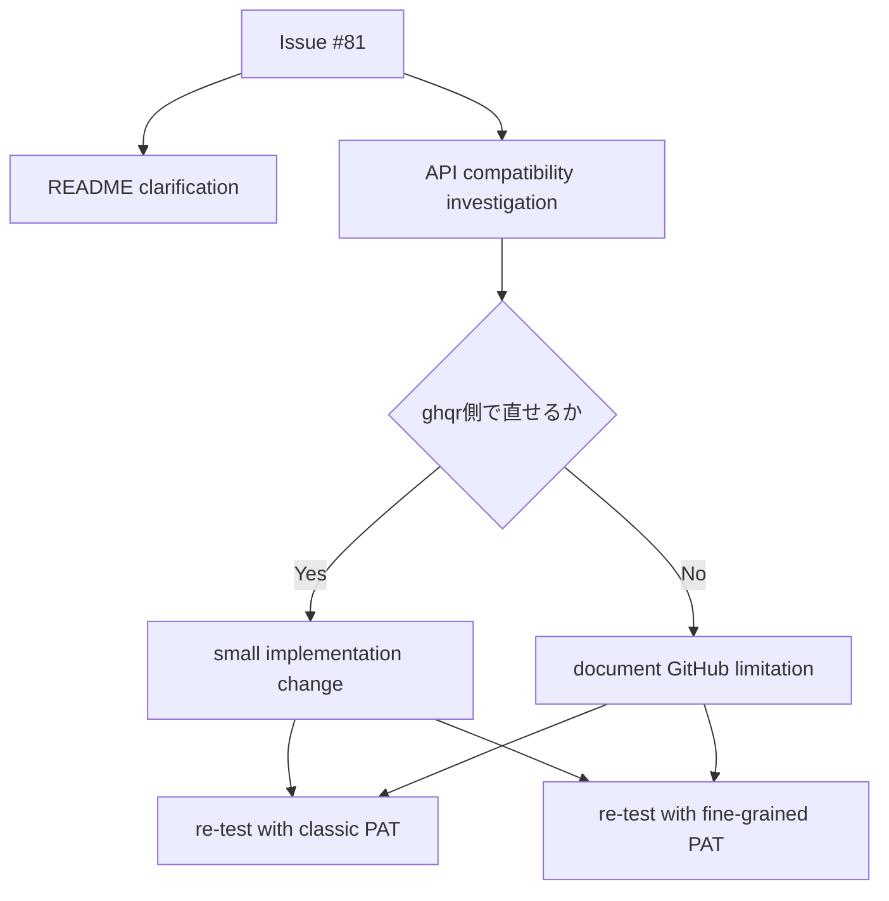
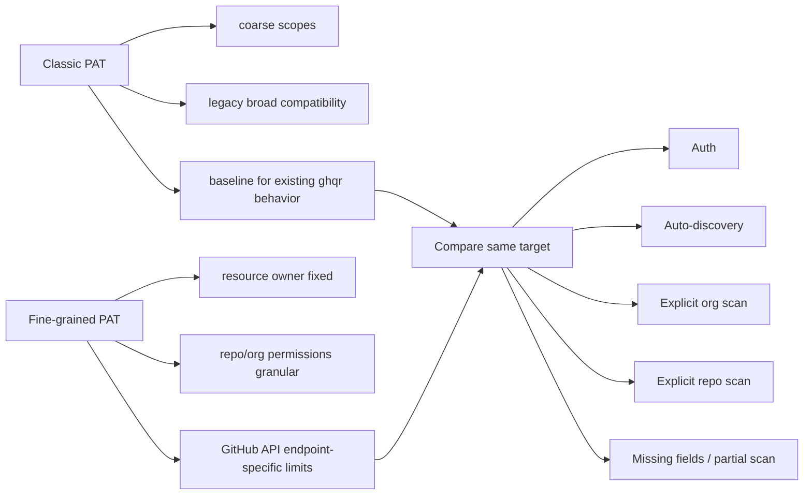
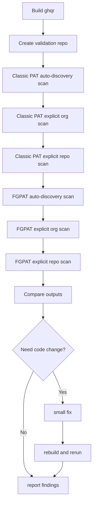
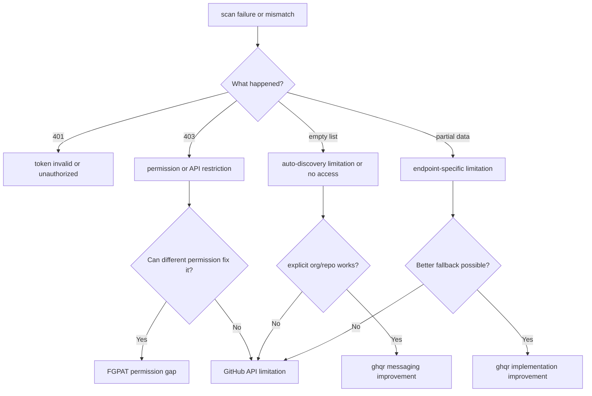
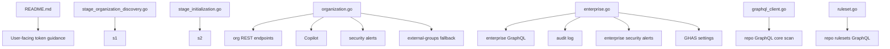
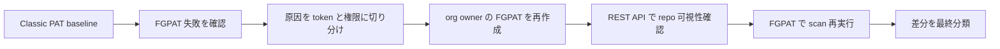
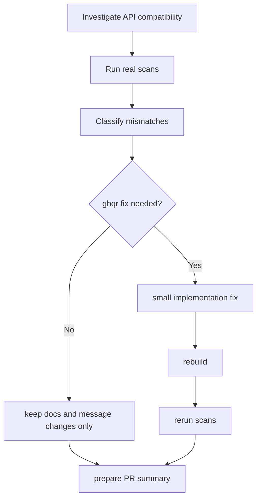

# ghqr Fine-Grained PAT Validation Design

## 1. 目的

`ghqr` が Classic PAT と Fine-grained PAT を使ったときに、どこまで同等に動作するかを実スキャンで比較する。

比較結果から、差分を次のどれかに分類する。

- Fine-grained PAT の権限設定不足
- GitHub API 側の fine-grained PAT 制限
- `ghqr` 側で改善できる実装またはエラーメッセージ

## 2. 前提条件

- Organization: `example-org`
- URL: `https://github.com/example-org`
- Validation repository: `example-org/fgpat-validation-repo`
- Validation repository URL: `https://github.com/example-org/fgpat-validation-repo`
- Classic PAT は `CLASSIC_GH_TOKEN` に export 済み
- Fine-grained PAT は `FGPAT_GH_TOKEN` に export 済み
- Fine-grained PAT 設定:
  - Resource owner: `example-org`
  - Repository access: `All repositories`
  - 基本的に全項目 `Read`
  - `Write` 権限なし

## 3. 私の制約

- token 値は絶対に表示しない
- `echo` / `env` / `printenv` などで token を出さない
- `.codex` は触らない
- `.gitignore` は変更しない
- `audit_data/` 配下だけを作業資料置き場に使う
- `audit_data/` 配下の資料は commit 対象に含めない
- README だけで終わらせず、必要なら実装も直す
- 差分は小さく保つ

## 4. これまでの指示の変遷

1. 最初は Issue #81 向けに README を最小修正する依頼だった
2. 次に README の表現を過大にしないよう、FGPAT の制約を明示する方針に変わった
3. その後、README ではなく実装変更が必要かを、GitHub API 呼び出し単位で調査する依頼に変わった
4. 調査の結果、organization auto-discovery は fine-grained PAT で空配列になり得るため、実装側メッセージ改善を入れた
5. 現在は、Classic PAT と Fine-grained PAT の実スキャン比較で実害を確認し、差分原因を分類する段階に入った

## 5. 現在の変更ファイル

- `README.md`
- `internal/pipeline/stage_organization_discovery.go`

補助資料:

- `audit_data/ghqr-fgpat-test-notes.md`
- `audit_data/fgpat-validation-repo-design.md`

## 6. 変更設計

現在のコード変更方針は次のとおり。

- 認証ロジックそのものは変えない
- token の受け渡しは bearer token のまま使う
- Classic PAT 前提で誤解を生む挙動だけ直す
- 実スキャンで確認できた問題だけを小さく修正する



## 7. Classic PAT と FGPAT の比較観点

- 認証成功するか
- auto-discovery が動くか
- `--organization` 明示時に動くか
- `--repository` 明示時に動くか
- enterprise 系 endpoint が動くか
- organization 系 endpoint がどこまで動くか
- repository 系 GraphQL がどこまで動くか
- 401 / 403 / 空配列 / 一部欠落 のどれで失敗するか



## 8. 実スキャン検証計画

1. `ghqr` をビルドする
2. `example-org` 配下に検証用 repository を作る
3. Classic PAT で `ghqr scan` を実行する
4. Fine-grained PAT で同じ対象に対して `ghqr scan` を実行する
5. auto-discovery と明示指定を比較する
6. 出力 JSON / ログ / 終了コードを比較する
7. 原因を分類する
8. `ghqr` 側で改善可能なら最小修正する
9. 再ビルド・再実行する



作成済み検証用 repository:

- Name: `example-org/fgpat-validation-repo`
- Visibility: `private`
- Description: `Validation repository for ghqr fine-grained PAT testing`

## 9. 失敗時の分類

### A. Fine-grained PAT の権限設定不足

例:

- 403 が出る
- 対象 repo は見えるが security alerts だけ取得できない
- Actions / Members / Administration 系だけ欠ける

### B. GitHub API 側の fine-grained PAT 制限

例:

- endpoint 自体が fine-grained PAT では部分対応
- enterprise 系 endpoint が classic PAT 同等ではない
- auto-discovery endpoint が empty list を返す

### C. `ghqr` 側の改善余地

例:

- ログが「組織がない」としか出ず、FGPAT 制限だと分からない
- 403 を generic error として返してしまう
- fallback できるのにしていない



## 10. API 呼び出し観点の責務



## 11. 実スキャンで見る具体的な比較項目

- 終了コード
- ログに出る warning / error
- 組織一覧取得可否
- repository 一覧取得可否
- repo metadata
- branch protection / rulesets
- collaborators / deploy keys
- dependabot / code scanning / secret scanning
- Copilot
- enterprise 関連項目



## 12. 作業ログ引き継ぎ

この章は、後続チャット、PR 作成、Issue コメント作成にそのまま引き継げるように、実行コマンド、実行セッション、結果、一次分類を時系列で整理したもの。

### 12.1 セッション定義

- `ユーザーのWSL shell`
  - ユーザーが直接操作する通常シェル
  - `CLASSIC_GH_TOKEN` や `FGPAT_GH_TOKEN` を export 済みでも、Codex 実行 shell とは別プロセス
- `Codex実行 shell`
  - この会話から `exec_command` で起動されるシェル
  - ユーザー shell の export 済み環境変数は自動では見えない
- `GH_CONFIG_DIR=/tmp/gh-fgpat`
  - 個人 owner `example-user` の Fine-grained PAT を隔離した `gh` 設定
- `GH_CONFIG_DIR=/tmp/gh-fgpat-org`
  - org owner `example-org` の Fine-grained PAT を隔離した `gh` 設定

### 12.2 token 取り扱いルール

- token 値は記録しない
- token の一部も記録しない
- token を command argument に直接書かない
- token を `echo`、`env`、`printenv` で表示しない
- token は `gh auth login --with-token` で標準入力から登録する
- `gh auth token` を内部利用し、一時的に `GITHUB_TOKEN` に渡して `ghqr` を実行する
- token を shell の `export GITHUB_TOKEN=...` で永続保持しない

### 12.3 生成物の出力先

- `./bin/linux_amd64/ghqr` の生成物は、実行時のカレントディレクトリ `~/dev/lab/oss/ghqr` に出力された
- 生成物は JSON、Excel、Markdown の 3 種

### 12.4 Classic PAT baseline

- 目的:
  - explicit repository scan の基準結果を取る
- 実行セッション:
  - `Codex実行 shell`
- 実行前に分かったこと:
  - `CLASSIC_GH_TOKEN` は `ユーザーのWSL shell` には export 済みでも `Codex実行 shell` からは見えなかった
  - そのため、Classic 側 baseline は `gh auth token` を利用して取得した token を内部利用する方針に切り替えた
- 失敗した確認コマンド:
```bash
[ -n "$CLASSIC_GH_TOKEN" ]
```
- 失敗した確認結果:
  - exit code `1`
  - `Codex実行 shell` からは `CLASSIC_GH_TOKEN` 未設定
- baseline 実行コマンド:
```bash
env GITHUB_TOKEN="$(gh auth token)" ./bin/linux_amd64/ghqr scan --repository example-org/fgpat-validation-repo
```
- 期待結果:
  - repository 明示指定 scan が成功し、成果物が出る
- 実際の結果:
  - 成功
  - 終了コード `0`
  - warning なし
  - error なし
  - 主なログ:
    - `Authenticated to GitHub user=example-user`
    - `Fetching repositories via GraphQL owner=example-org repos=["fgpat-validation-repo"]`
    - `Repository scan completed count=1`
    - `Running best-practice evaluations...`
    - `Evaluations completed`
    - `Rendering reports... results=6`
    - `Scan completed`
- 生成物:
  - `example-output.json`
  - `example-output.xlsx`
  - `example-output.md`
- 一次分類:
  - 成功 baseline

### 12.5 token 取り扱いの詰まり

- 問題:
  - `export FGPAT_GH_TOKEN=...` は `ユーザーのWSL shell` と `Codex実行 shell` が別なので、Codex 側から見えなかった
- 実行セッション:
  - `Codex実行 shell`
- 存在確認コマンド:
```bash
[ -n "$FGPAT_GH_TOKEN" ]
```
- 結果:
  - exit code `1`
  - `Codex実行 shell` では `FGPAT_GH_TOKEN` 未設定
- 試した方式 1:
  - `read -s` で一時的に token を読み取る方式
- 実行コマンド:
```bash
bash -lc 'read -s -p "FGPAT_GH_TOKEN: " FGPAT_GH_TOKEN; echo; export FGPAT_GH_TOKEN; if [ -n "$FGPAT_GH_TOKEN" ]; then echo "FGPAT_GH_TOKEN is set"; else echo "FGPAT_GH_TOKEN is empty"; exit 1; fi; env GITHUB_TOKEN="$FGPAT_GH_TOKEN" ./bin/linux_amd64/ghqr scan --repository example-org/fgpat-validation-repo'
```
- 結果:
  - 非表示入力待ちにはなったが、ユーザーが手入力を望まなかったため中断
- 試した方式 2:
  - `GH_CONFIG_DIR` を分けて `gh` CLI の認証情報を隔離する方式
- 作成コマンド:
```bash
mkdir -p /tmp/gh-fgpat
```
- 補足:
  - `/tmp/gh-fgpat` は最初の Fine-grained PAT 用
  - `/tmp/gh-fgpat-org` は org owner で作り直した Fine-grained PAT 用
  - `gh auth login --with-token` 実行時に `Authentication credentials saved in plain text` が出るため、検証後は `/tmp/gh-fgpat-org` 削除推奨
- 一次分類:
  - `shell / token / 環境問題`

### 12.6 最初の Fine-grained PAT 失敗

- 前提:
  - 個人 owner `example-user` の Fine-grained PAT を使用した
  - 設定は `Access on example-user`
  - `all repositories owned by you`
  - 対象は org repo `example-org/fgpat-validation-repo`
- 実行セッション:
  - `GH_CONFIG_DIR=/tmp/gh-fgpat`
- ログイン登録コマンド:
```bash
GH_CONFIG_DIR=/tmp/gh-fgpat gh auth login --hostname github.com --with-token
```
- ログイン確認コマンド:
```bash
GH_CONFIG_DIR=/tmp/gh-fgpat gh auth status
```
- 結果:
  - `gh` ログイン自体は成功
- REST API 可視性確認コマンド:
```bash
GH_CONFIG_DIR=/tmp/gh-fgpat gh api repos/example-org/fgpat-validation-repo --jq .full_name
```
- REST API 結果:
  - `404 Not Found`
- scan 実行コマンド:
```bash
env GITHUB_TOKEN="$(GH_CONFIG_DIR=/tmp/gh-fgpat gh auth token)" ./bin/linux_amd64/ghqr scan --repository example-org/fgpat-validation-repo
```
- scan 結果:
  - 終了コード `0`
  - warning なし
  - error:
    - `Failed to fetch repositories error="GraphQL batch errors: Could not resolve to a Repository with the name 'example-org/fgpat-validation-repo'."`
  - 主なログ:
    - `Authenticated to GitHub user=example-user`
    - `Fetching repositories via GraphQL owner=example-org repos=["fgpat-validation-repo"]`
    - `Repository scan completed count=1`
    - `No scan results to render`
- なぜ失敗したか:
  - token は有効でも、Resource owner と Repository access の設定が対象 org repository と一致していなかった
- 結論:
  - `ghqr` 不具合ではなく、FGPAT の `Resource owner / Repository access` 設定ミス
- 一次分類:
  - `FGPAT設定不足`

### 12.7 成功した Fine-grained PAT 構成

- Resource owner:
  - `example-org`
- Repository access:
  - `Only select repositories`
- 対象 repository:
  - `example-org/fgpat-validation-repo`
- Repository permissions:
  - `Metadata: Read-only`
  - `Contents: Read-only`
  - `Administration: Read-only`
- token 管理方針:
  - `/tmp/gh-fgpat-org` を `GH_CONFIG_DIR` に指定して隔離管理
  - `gh auth login --with-token` を使い、token を command argument に書かない
  - `gh auth token` を内部的に利用し、一時的に `GITHUB_TOKEN` に渡して scan する

### 12.8 作り直した Fine-grained PAT の REST API 成功

- 実行セッション:
  - `ユーザーのWSL shell`
  - `GH_CONFIG_DIR=/tmp/gh-fgpat-org`
- ログイン登録コマンド:
```bash
printf '%s\n' "$FGPAT_GH_TOKEN" | GH_CONFIG_DIR=/tmp/gh-fgpat-org gh auth login --hostname github.com --with-token
```
- ログイン確認コマンド:
```bash
GH_CONFIG_DIR=/tmp/gh-fgpat-org gh auth status
```
- REST API 検証コマンド:
```bash
GH_CONFIG_DIR=/tmp/gh-fgpat-org gh api repos/example-org/fgpat-validation-repo --jq .full_name
```
- 期待結果:
  - private repository が可視化できる
- 実際の結果:
```text
example-org/fgpat-validation-repo
```
- 解釈:
  - FGPAT が対象 private repository を正常に可視化できている
- 一次分類:
  - 成功

### 12.9 作り直した Fine-grained PAT での ghqr scan 成功

- 実行セッション:
  - `Codex実行 shell`
  - token source は `GH_CONFIG_DIR=/tmp/gh-fgpat-org`
- scan 実行コマンド:
```bash
env GITHUB_TOKEN="$(GH_CONFIG_DIR=/tmp/gh-fgpat-org gh auth token)" \
./bin/linux_amd64/ghqr scan \
--repository example-org/fgpat-validation-repo
```
- 期待結果:
  - Classic baseline と同様に explicit repository scan が完走する
- 実際の結果:
  - GraphQL repository 解決成功
  - ruleset enrichment 成功
  - evaluation 成功
  - report rendering 成功
  - JSON / Excel / Markdown 出力成功
  - `results=6`
  - scan 完走
- 生成物:
```text
example-output.json
example-output.xlsx
example-output.md
```
- 生成場所:
  - `~/dev/lab/oss/ghqr`
- 一次分類:
  - 成功

### 12.10 失敗と成功の因果関係

- 最初に失敗した理由:
  - `Codex実行 shell` から `FGPAT_GH_TOKEN` が見えなかった
  - 個人 owner `example-user` の Fine-grained PAT では org repository `example-org/fgpat-validation-repo` にアクセスできなかった
- 何を直したら成功したか:
  - token 受け渡しは `GH_CONFIG_DIR` を使う隔離管理に切り替えた
  - Fine-grained PAT を `example-org` owner で作り直した
  - `Only select repositories` で対象 repository を明示選択した
  - `Metadata`、`Contents`、`Administration` の read 権限を付与した

### 12.11 最終結論

- `ghqr` は少なくとも explicit repository scan では Fine-grained PAT を利用可能
- 前回の失敗原因は `ghqr` 側ではなく、FGPAT の `Resource owner / Repository access` 設定ミス
- README には「FGPAT は利用可能。ただし Resource owner と Repository access 設定が重要」と書くのが妥当
- 少なくとも今回の repository scan については、`ghqr` 側に FGPAT 非対応問題は確認できなかった
- `organization auto-discovery`、`enterprise`、`audit log`、`Copilot`、`security endpoint` は別途検証対象として残る

### 12.12 今後の調査候補

- `organization auto-discovery`
- `enterprise endpoint`
- `audit log endpoint`
- `Copilot endpoint`
- `security feature` 系 endpoint
- permission 不足時の warning 改善
- README の FGPAT 注意事項整理

### 12.13 以後の運用ルール

以後、詰まりが発生した場合は必ずこのファイルに次を追記すること。

- 実行コマンド
- 実行セッション
- 期待結果
- 実際の結果
- error / warning
- 一次分類
  - `FGPAT設定不足`
  - `GitHub API仕様/制限`
  - `実装/UX改善余地`
  - `shell / token / 環境問題`
- 次に確認する事項

## 13. PR までの流れ



## 14. token を使うコマンドの考え方

token を使うのは、次のような GitHub API に接続するコマンドだけ。

- `ghqr scan ...`
- `gh api ...`
- `gh repo create ...` のうち認証が必要なもの

逆に、次は token を使わない。

- `make build`
- `go test ./...`
- `git diff`
- `git status`

token を使うコマンドを実行するときは、値を画面に出さず、必要最小限の環境変数参照だけを使う。
